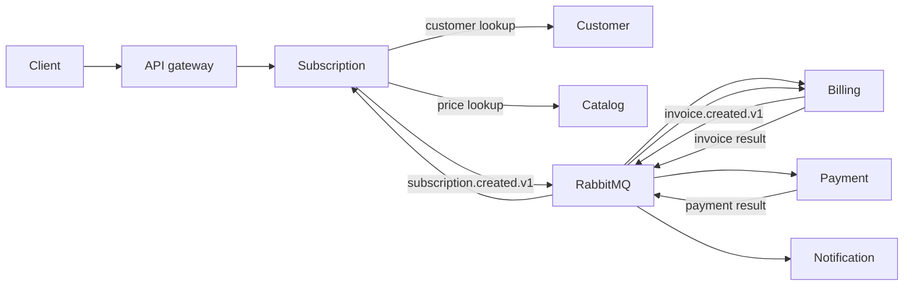

# Billing Platform

*[Русская версия](README.ru.md)*

A billing and subscription platform implemented as seven PHP 8.4.1+/Laravel
services: Identity, Customer, Catalog, Subscription, Billing, Payment, and
Notification. The repository includes a local Docker Compose stack,
Kubernetes manifests, an OpenAPI contract, and cross-service test suites.

## Services

| Service | Responsibility |
| --- | --- |
| Identity | Accounts, merchants, memberships, API keys, and access tokens |
| Customer | Customer records and billing contacts |
| Catalog | Products and recurring prices |
| Subscription | Subscription lifecycle and renewal scheduling |
| Billing | Invoices and billing cycles |
| Payment | Payment attempts and provider results |
| Notification | Payment receipt notifications |

## Tech stack

- **Language/framework:** PHP 8.4.1+, Laravel 13, served through FrankenPHP
- **Database:** PostgreSQL, one logical database per service
- **Messaging:** RabbitMQ for cross-service events
- **API contract:** OpenAPI 3.1 ([docs/openapi/openapi.yaml](docs/openapi/openapi.yaml))
- **Containerization:** Docker Compose for local development, Kubernetes
  manifests for cluster deployment (with `kind` for local cluster testing)
- **Load testing:** k6

## Key engineering decisions

Each service owns a logical PostgreSQL database and is reached through HTTP
for synchronous lookups. State changes propagate through RabbitMQ instead of
direct service-to-service calls, so services stay decoupled from each other's
availability.

Local database writes and outgoing events are committed together through a
transactional outbox: a service writes its own state and the event row in the
same database transaction, then a separate publisher reads the outbox table
and puts events on RabbitMQ. This avoids the dual-write problem where a
database commit succeeds but the matching event never gets published (or gets
published for a transaction that later rolls back).

Consumers deduplicate incoming events through an inbox table, so a redelivered
message (RabbitMQ's at-least-once delivery, a consumer crash after processing
but before acknowledging) does not get applied twice.



See [the architecture notes](docs/architecture/overview.md),
[ADR index](docs/adr/README.md), and
[event catalog](docs/architecture/event-catalog.md) for the detailed contracts.

## Project structure

| Path | Purpose |
| --- | --- |
| `services/` | The seven Laravel services (one directory each) |
| `packages/` | Shared Composer packages: auth contract, messaging contract, testing conventions |
| `infrastructure/` | Kubernetes manifests, Nginx gateway config, PostgreSQL/RabbitMQ setup |
| `docs/` | Architecture notes, ADRs, event catalog, OpenAPI contract |
| `tests/` | Component, integration, E2E, resilience, load, and kind test suites |
| `scripts/` | Markdown/OpenAPI checks, `.env` generation, Kubernetes secret provisioning |

## How to run

Requirements: Docker, Docker Compose, GNU Make, PHP 8.4.1 or later, and
Composer.

Create `.env` with local application keys, signing keys, service credentials,
and infrastructure passwords:

```bash
make init
```

Start the platform and check the gateway:

```bash
make up
make health
```

Useful commands:

| Command | Purpose |
| --- | --- |
| `make ps` | Show containers |
| `make logs` | Follow container logs |
| `make down` | Stop the stack |
| `make clean` | Stop the stack and remove local volumes |
| `make rotate-secrets` | Replace the local secret set |
| `make kind-secrets` | Provision the ignored `.env` values as Kubernetes Secrets |

The gateway listens on `http://localhost:8080`. PostgreSQL uses port `5432`;
RabbitMQ uses `5672`, with its management UI on `http://localhost:15672`.

## Environment variables and secrets

`make init` generates `.env` from [`.env.example`](.env.example) using
[`scripts/generate-env.php`](scripts/generate-env.php), which fills in the
values below. None of them are checked in.

| Variable | Purpose |
| --- | --- |
| `APP_KEY`, `*_APP_KEY` | Laravel application key per service, generated locally |
| `AUTH_ED25519_PUBLIC_KEY_BASE64` / `AUTH_ED25519_SECRET_KEY_BASE64` | Keypair used to sign and verify access tokens |
| `INTERNAL_SERVICE_ACCESS_TOKEN` | Shared token for service-to-service calls |
| `POSTGRES_USER` / `POSTGRES_PASSWORD` / `POSTGRES_DB` | Local PostgreSQL credentials |
| `RABBITMQ_DEFAULT_USER` / `RABBITMQ_DEFAULT_PASS` | Local RabbitMQ credentials |

`make rotate-secrets` regenerates the generated values without touching the
rest of `.env`. For a cluster, `make kind-secrets` reads the same `.env` and
provisions its values as Kubernetes Secrets instead of committing them to
manifests.

## API documentation

The full contract is in [OpenAPI 3.1](docs/openapi/openapi.yaml)
(`docs/openapi/openapi.yaml`). `make test-docs` checks that every documented
route matches an implemented one.

Register an owner and bootstrap a merchant:

```bash
curl -X POST http://localhost:8080/v1/auth/register \
  -H "Content-Type: application/json" \
  -d '{
    "email": "owner@example.com",
    "password": "correct-horse-battery",
    "merchant_name": "Acme Inc"
  }'
```

```json
{
  "token_type": "Bearer",
  "access_token": "eyJhbGciOiJFZERTQSJ9...",
  "expires_in": 900,
  "merchant_id": "018f2f3e-6b0a-7c3e-9b0a-6b0a7c3e9b0a",
  "role": "owner",
  "refresh_token": "def502...",
  "user_id": "018f2f3e-6b0a-7c3e-9b0a-6b0a7c3e9b0b"
}
```

Use `access_token` as a bearer token against tenant-scoped routes:

```bash
curl http://localhost:8080/v1/merchants/{merchant_id}/customers \
  -H "Authorization: Bearer $ACCESS_TOKEN"
```

## Database migrations

Each service runs its own Laravel migrations on container start
(`php artisan migrate --force`, see `docker-compose.yaml`), so `make up`
migrates every database automatically. To run a service's migrations by hand,
for example after adding one:

```bash
docker compose exec identity-api php artisan migrate
```

## Tests

| Command | Scope |
| --- | --- |
| `make test` | Unit, integration, and feature suites for all services |
| `make test-docs` | Markdown links/translations and OpenAPI-to-route checks |
| `make test-compose` | Component, service integration, E2E, and resilience suites |
| `make test-kind` | Ingress, rollout, and business smoke tests against an existing kind cluster |
| `make test-load` | Bounded k6 smoke test against a disposable Compose stack |
| `make test-all` | All checks above |

`make test-kind` defaults to the `kind-pet-payment-billing-platform` context and
accepts `KIND_CONTEXT=<context>`. It performs an intentional rolling restart of
`billing-api`. The Compose test targets create isolated stacks and remove their
volumes after each suite.

The test layout and boundary rules are documented in
[docs/architecture/testing-strategy.md](docs/architecture/testing-strategy.md).

## Limitations

The repository currently uses fake payment and email adapters. Application
code propagates correlation IDs, but does not yet export OpenTelemetry
telemetry. Production deployment also requires an external secret store, real
provider adapters, and environment-specific capacity and SLO configuration.

The root Compose file runs all APIs, workers, PostgreSQL, RabbitMQ, and the
Nginx gateway. Kubernetes resources live under `infrastructure/kubernetes/`;
the local overlay runs the same seven services with PostgreSQL and
single-node RabbitMQ. Operator-backed RabbitMQ, KEDA, External Secrets, and
observability resources are optional platform overlays, not deployed by
default.

## License

MIT, per [`LICENSE`](LICENSE).
