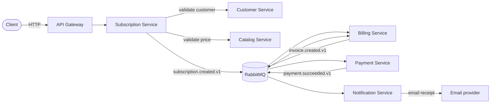
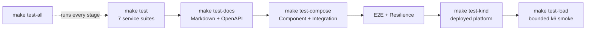

# Billing Platform

*[Русская версия](README.ru.md)*

A billing and subscription platform built as a set of independently
deployable PHP/Laravel services.

This is a project for working through distributed billing systems in
practice: Clean Architecture, Hexagonal Architecture, DDD, event-driven
communication between services.

> All seven services, authentication, tenant isolation, reliable messaging,
> local Docker Compose, Kubernetes manifests, CI/CD and the full test pyramid
> are implemented. See "Status" for the remaining production caveats.

## Goals

What the platform is meant to do:

- customer management
- product and price catalogs
- subscriptions and recurring billing
- invoice generation
- payment processing and refunds
- payment provider integrations
- async notifications

And the reliability side that comes with any distributed system:

- each service owns its own data
- eventual consistency
- idempotency (keys, idempotent consumers/inbox)
- transactional outbox
- retries and dead-letter queues
- distributed tracing and observability

## Architecture

Microservices, each one an independently executable Laravel app with its
own database.

Services:

| Service | Responsibility |
| --- | --- |
| Identity Service | Merchant authentication and authorization |
| Customer Service | Customers and billing profiles |
| Catalog Service | Products, prices and discounts |
| Subscription Service | Subscription lifecycle |
| Billing Service | Invoices and billing cycles |
| Payment Service | Payments, refunds and payment providers |
| Notification Service | Asynchronous customer notifications |

Services talk to each other over HTTP when they need an answer right
away, and through RabbitMQ events for everything else (most cross-service
workflows).

The main successful subscription flow shows where synchronous validation
ends and the event-driven chain begins:



## Repository structure

```text
pet-payment-billing-platform/
├── services/
├── packages/
├── infrastructure/
│   ├── nginx/
│   ├── postgres/
│   ├── rabbitmq/
│   └── kubernetes/
│       ├── base/
│       └── platform/
├── docs/
│   ├── architecture/
│   └── adr/
├── scripts/
├── tests/
│   ├── component/
│   ├── integration/
│   ├── e2e/
│   ├── resilience/
│   └── kind/
├── docker-compose.yaml
└── Makefile
```

### services

All seven Laravel services. Each is independently runnable with its own
database. Each has a Dockerfile, runs in the `kind` cluster under
`infrastructure/kubernetes/`, and is wired into local `docker-compose.yaml`.

### packages

Shared technical contracts only, things like protocol definitions or
client SDKs. Domain models stay inside each service, never shared.

### infrastructure

Local and platform-level infra config.

Local dev runs the complete platform through Docker Compose.

`infrastructure/kubernetes/` is a separate, cluster-facing layer:

- `base/` sets up the namespace and other cluster-wide bits
- `platform/` covers ingress, RabbitMQ, KEDA, External Secrets and the
  observability stack (OpenTelemetry Collector, Prometheus, Grafana,
  Tempo, Loki). Details in `infrastructure/kubernetes/platform/README.md`.

`make up` uses the local Compose stack; cluster workloads remain a separate
deployment target under `infrastructure/kubernetes/`.

### docs

Architecture notes and ADRs. English is canonical; every user-facing
Markdown document has a Russian translation alongside it as `*.ru.md`,
with a language switch at the top of both versions. The implemented
public HTTP contract is available as an
[OpenAPI 3.1 specification](docs/openapi/openapi.yaml).

### tests

Cross-service tests that don't belong to any single service — see
[`docs/architecture/testing-strategy.md`](docs/architecture/testing-strategy.md)
for the full pyramid (each service's own `tests/Unit`, `Integration`
and `Feature` cover everything below this level):

- `integration/` — 2-3 real services through a real RabbitMQ, each its
  own Docker Compose stack + standalone Pest project.
- `component/` — one real service with WireMock replacing its outbound
  HTTP dependencies.
- `e2e/` — full business flows across every service, fake
  payment/email providers.
- `resilience/` — failure-mode scenarios (duplicate delivery, consumer
  crash, broker outage), not business scenarios.
- `kind/` — platform smoke tests against the live Kubernetes deployment:
  Ingress routing, zero-downtime rollout, and one business canary.

## Principles

### Service ownership

Each service owns its logic and its data. No service reaches into
another service's database directly.

### Database per service

Every service's data is logically isolated, even though locally they
might all sit on the same PostgreSQL instance for convenience. Ownership
stays separate no matter where the bytes physically live.

### Clean Architecture

Business rules don't know about Laravel, Eloquent, RabbitMQ, PostgreSQL
or payment providers. Dependencies point inward, toward the domain.

### Hexagonal Architecture

Anything external (databases, payment providers, message brokers, other
APIs) goes through ports and adapters, not called directly from business
logic.

### Domain-Driven Design

Used where it actually pays off, not forced onto every corner of the
system.

### Event-driven communication

Services announce state changes as events over RabbitMQ instead of
calling each other directly.

## Local development

### Requirements

- Docker
- Docker Compose
- GNU Make

### Setup

Generate a private local `.env` (random application keys, Ed25519 signing
keys, infrastructure passwords and a short-lived internal service token):

```bash
make init
```

The generated file is ignored by Git. `.env.example` contains names only;
the Compose file has no credential fallbacks. To provision the same values
as native Secrets in the local kind cluster, run `make kind-secrets`.

Start everything:

```bash
make up
```

See what's running:

```bash
make ps
```

Ping the gateway:

```bash
make health
```

Stop everything:

```bash
make down
```

Remove containers and local volumes:

```bash
make clean
```

## Testing

The commands mirror the test layers: start with fast service feedback,
then validate real boundaries, complete workflows, failure recovery, and
finally the deployed platform.



Run all seven service test suites (the fast default for local work):

```bash
make test
```

Validate every EN/RU Markdown pair, local documentation link, and the
OpenAPI contract against the routes registered by all services:

```bash
make test-docs
```

Run all standalone Component, Service integration, E2E, and Resilience
suites. Each temporary Docker Compose stack is removed, with its volumes,
after the suite finishes or fails:

```bash
make test-compose
```

Run the three Kubernetes smoke tests against the existing
`kind-pet-payment-billing-platform` cluster without changing the current
`kubectl` context:

```bash
make test-kind
```

Override the context when necessary:

```bash
make test-kind KIND_CONTEXT=my-kind-context
```

Run the bounded k6 load smoke against an isolated disposable Compose stack:

```bash
make test-load
```

Run the complete quality gate in that order:

```bash
make test-all
```

`make test` and `make test-docs` require PHP 8.5 and Composer with the
service dependencies installed. The Compose and kind targets additionally
require Docker and `kubectl`; `test-kind` expects an already deployed,
ready cluster and performs the suite's intentional `billing-api` rolling
restart. `test-load` runs k6 in a container and removes its isolated Compose
stack and volumes afterward.

## Local endpoints

| Component | Address |
| --- | --- |
| API Gateway | `http://localhost:8080` |
| Gateway Health | `http://localhost:8080/health` |
| PostgreSQL | `localhost:5432` |
| RabbitMQ | `localhost:5672` |
| RabbitMQ Management | `http://localhost:15672` |

Credentials live in `.env`.

`make up` starts the gateway, all seven APIs, PostgreSQL, RabbitMQ,
outbox relays, event consumers, notification delivery and subscription
renewal. Register through `POST /v1/auth/register`, then send the returned
bearer access token to tenant-scoped `/v1/merchants/{merchant}/...` routes.

## Technology roadmap

Initial infrastructure:

- Docker Compose
- Nginx
- PostgreSQL
- RabbitMQ

Application stack:

- PHP
- Laravel
- PostgreSQL
- Redis
- RabbitMQ

Architecture:

- Clean Architecture
- Hexagonal Architecture
- Domain-Driven Design
- Event-Driven Architecture

Reliability:

- Transactional Outbox
- Inbox / Idempotent Consumer
- Idempotency Keys
- Retry policies
- Dead Letter Queues
- Saga / Process Manager

Observability:

- OpenTelemetry
- Prometheus
- Grafana
- Tempo
- Loki

Deployment:

- Docker
- CI/CD
- Kubernetes

## Status

Feature-complete as a production-style reference implementation; production
deployment still requires external secret management, real provider adapters
and environment-specific capacity/SLO tuning.

All seven services exist (Identity, Customer, Catalog, Subscription,
Billing, Payment, Notification), each a fully working Clean/Hexagonal
Laravel app with its own tests. No new services are planned — the
business decomposition is done. What's left is turning these seven
Laravel apps into an actual production-style platform, roughly in this
order:

1. **API Gateway / Ingress** — done for the routing/auth-boundary design
   (see [ADR 0001](docs/adr/0001-api-gateway-routing.md)) and reachable
   end-to-end in the `kind` cluster (Ingress → gateway → each service);
   and through local Docker Compose (`make up`).
2. RabbitMQ topology — messaging contract, naming, envelope and queue
   topology rules are written down
   ([ADR 0002](docs/adr/0002-rabbitmq-messaging.md) +
   [event catalog](docs/architecture/event-catalog.md)), formalizing
   what five services had already been doing by imitation. The
   platform's core event chain is now wired end to end (Subscription →
   Billing → Payment → Billing/Subscription/Notification), including
   Billing translating payment outcomes into `subscription_id`-bearing
   events for Subscription to consume, and catalog-service's Outbox
   actually reaching RabbitMQ (was stuck on a log-only publisher).
   Consumers use bounded retries, durable DLQs and prefetch=1; outbox
   publishers wait for RabbitMQ confirms before marking rows published.
3. Distributed reliability — transactional Outbox/Inbox, idempotent
   consumers, broker outage recovery, duplicate delivery and crash-before-ack
   are implemented and exercised by real PostgreSQL/RabbitMQ suites.
4. Observability — correlation IDs are generated/preserved across HTTP and
   messaging headers; deployable Prometheus/Grafana/Tempo/Loki/OTel Collector
   manifests live under `infrastructure/kubernetes/platform/observability/`.
5. Docker / local environment — complete: `docker-compose.yaml` runs the
   platform, while isolated stacks under `tests/` prove specific boundaries.
6. Kubernetes — done for the core RabbitMQ vertical slice: all seven
   services run in a local `kind` cluster (`infrastructure/kubernetes/`),
   each split into the right workloads (API Deployment, plus a Consumer
   and/or Outbox Deployment for whichever have messaging roles — not
   one Pod per service), with health probes, PodDisruptionBudgets and
   topology spread. NetworkPolicy and HPA/KEDA manifests exist but
   aren't applied locally (`kind`'s CNI doesn't enforce NetworkPolicy,
   and there's no metrics-server) — see
   `infrastructure/kubernetes/platform/README.md`.
7. CI/CD — GitHub Actions run a seven-service test matrix, contract/Compose
   checks, real component/integration/E2E/resilience suites, dependency and
   secret scans, and build/publish SBOM-backed service images to GHCR.
8. Contract + end-to-end testing — a full pyramid, not one big E2E
   suite: Unit/Application/Integration per service (exists already),
   plus new Component, Contract, Service integration, E2E and
   Resilience layers built one vertical slice at a time, same as the
   RabbitMQ chain itself was
   ([ADR 0004](docs/adr/0004-testing-strategy.md) +
   [testing strategy](docs/architecture/testing-strategy.md)). All five
   service integration slices for the platform's core event chain done
   (real Postgres, real RabbitMQ, no mocking): `subscription-to-billing`,
   `billing-to-payment`, `payment-to-billing`, `billing-to-subscription`
   and `payment-to-notification`, in
   [`tests/integration/`](tests/integration/). Plus three full E2E
   scenarios: [`successful-subscription`](tests/e2e/successful-subscription/)
   (all seven services, real infra, no shortcuts — Merchant → Customer →
   Product/Price → Subscription → Invoice → Payment → Subscription
   Active → Notification, walked entirely through real HTTP) and
   [`failed-payment`](tests/e2e/failed-payment/) (same chain, but the
   Price's amount is `FakePaymentGateway`'s reserved decline-trigger
   value, so the charge is guaranteed to decline — proves the Invoice
   stays Open, the Payment ends up Failed with a real failure code, and
   the Subscription stays Pending rather than PastDue). Plus all four
   originally planned resilience tests, done:
   [`duplicate-delivery`](tests/resilience/duplicate-delivery/) (the
   same `event_id` published twice, proving Billing's Inbox actually
   stops the second one from creating a duplicate Invoice — verified
   live that the consumer genuinely processed both deliveries, not that
   a race just meant the second one never arrived),
   [`outbox-recovery`](tests/resilience/outbox-recovery/) (the test
   stops `billing-outbox` itself mid-scenario, creates an Invoice while
   it's down, then proves the missed row reaches the wire once it's
   running again),
   [`rabbitmq-outage`](tests/resilience/rabbitmq-outage/) (the test
   stops the broker itself; proves creating a Subscription isn't
   affected at all, then proves both the outbox relay and the consumer
   recover their own connections once RabbitMQ is back — verified live
   via genuine `Connection refused` errors in both workers' own logs
   while it was down) and
   [`consumer-crash`](tests/resilience/consumer-crash/) (kills
   `billing-consumer` for real, timed via a small, additive,
   off-by-default delay hook to land precisely between its DB commit
   and its AMQP ack, so RabbitMQ genuinely redelivers the message —
   proves the restarted consumer's own Inbox guard stops it from
   creating a duplicate Invoice). Plus the Contract layer's producer
   side, done: every `IntegrationEvent` class across all seven
   services — all 17 events in the
   [event catalog](docs/architecture/event-catalog.md) — has its own
   test proving it maps onto exactly the wire shape the catalog
   documents, with a fresh `event_id` every time. Plus two Component
   slices — each one real service as its own live process, real HTTP
   server, real Postgres, real RabbitMQ, with a WireMock stub standing
   in for its synchronous HTTP dependencies instead of the real
   services:
   [`subscription-service`](tests/component/subscription-service/)
   (stubs customer-service and catalog-service, its whole suite running
   in under two seconds) and
   [`notification-service`](tests/component/notification-service/)
   (stubs customer-service alone; publishes nothing, so this one
   exercises only the RabbitMQ consume side and its delivery worker).
   The separate [`tests/kind/`](tests/kind/) platform-smoke suite is
   also done: all seven Ingress routes, a live zero-downtime rolling
   restart of `billing-api`, and one successful-subscription canary
   through the deployed cluster. Its rollout test found and drove the
   fix for a real SIGTERM/Service-endpoint race: every API pod now gets
   a five-second `preStop` drain window before termination.
   The third and final planned E2E scenario,
   [`overdue-subscription`](tests/e2e/overdue-subscription/), is now
   complete too: recurring billing stores cycle boundaries, runs from
   a Kubernetes CronJob, creates the next Invoice through
   `subscription.renewal_due.v1`, and a failed renewal moves an
   initially Active subscription to PastDue.
9. Security hardening.
10. Load / failure testing.
