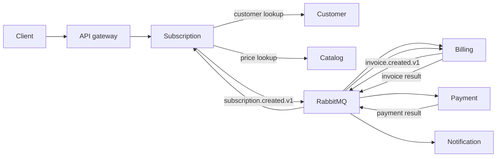

# Billing Platform

*[Русская версия](README.ru.md)*

A billing and subscription platform implemented as seven PHP 8.3+/Laravel
services. The repository includes a local Docker Compose stack, Kubernetes
manifests, an OpenAPI contract, and cross-service test suites.

## Services

| Service | Responsibility |
| --- | --- |
| Identity | Accounts, merchants, memberships, API keys, and access tokens |
| Customer | Customer records and billing contacts |
| Catalog | Products and recurring prices |
| Subscription | Subscription lifecycle and renewal scheduling |
| Billing | Invoices and billing cycles |
| Payment | Payment attempts and provider results |
| Notification | Payment receipt notifications |

Each service owns a logical PostgreSQL database. Synchronous lookups use HTTP;
state changes propagate through RabbitMQ. Local database changes and outgoing
events are committed together through a transactional outbox. Consumers use an
inbox for event deduplication.



See [the architecture notes](docs/architecture/overview.md),
[ADR index](docs/adr/README.md), and
[event catalog](docs/architecture/event-catalog.md) for the detailed contracts.
The implemented public HTTP API is defined in
[OpenAPI 3.1](docs/openapi/openapi.yaml).

## Local development

Requirements: Docker, Docker Compose, GNU Make, PHP 8.3 or later, and Composer.

Create `.env` with local application keys, signing keys, service credentials,
and infrastructure passwords:

```bash
make init
```

Start the platform and check the gateway:

```bash
make up
make health
```

Useful commands:

| Command | Purpose |
| --- | --- |
| `make ps` | Show containers |
| `make logs` | Follow container logs |
| `make down` | Stop the stack |
| `make clean` | Stop the stack and remove local volumes |
| `make rotate-secrets` | Replace the local secret set |
| `make kind-secrets` | Provision the ignored `.env` values as Kubernetes Secrets |

The gateway listens on `http://localhost:8080`. PostgreSQL uses port `5432`;
RabbitMQ uses `5672`, with its management UI on `http://localhost:15672`.
Credentials are stored in `.env`.

Register with `POST /v1/auth/register`, then send the returned bearer token to
tenant-scoped `/v1/merchants/{merchant}/...` routes.

## Tests

| Command | Scope |
| --- | --- |
| `make test` | Unit, integration, and feature suites for all services |
| `make test-docs` | Markdown links/translations and OpenAPI-to-route checks |
| `make test-compose` | Component, service integration, E2E, and resilience suites |
| `make test-kind` | Ingress, rollout, and business smoke tests against an existing kind cluster |
| `make test-load` | Bounded k6 smoke test against a disposable Compose stack |
| `make test-all` | All checks above |

`make test-kind` defaults to the `kind-pet-payment-billing-platform` context and
accepts `KIND_CONTEXT=<context>`. It performs an intentional rolling restart of
`billing-api`. The Compose test targets create isolated stacks and remove their
volumes after each suite.

The test layout and boundary rules are documented in
[docs/architecture/testing-strategy.md](docs/architecture/testing-strategy.md).

## Deployment and operational limits

The root Compose file runs all APIs, workers, PostgreSQL, RabbitMQ, and the Nginx
gateway. Kubernetes resources live under `infrastructure/kubernetes/`; the local
overlay runs the same seven services with PostgreSQL and single-node RabbitMQ.
Operator-backed RabbitMQ, KEDA, External Secrets, and observability resources are
optional platform overlays.

The repository currently uses fake payment and email adapters. Application code
propagates correlation IDs, but does not yet export OpenTelemetry telemetry.
Production deployment also requires an external secret store, real provider
adapters, and environment-specific capacity and SLO configuration.
