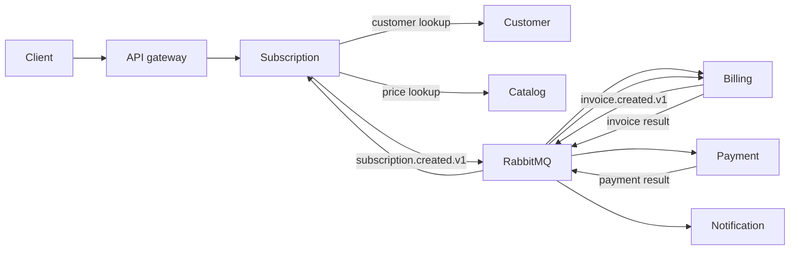

# Billing Platform

*[English version](README.md)*

Платформа биллинга и подписок из семи сервисов на PHP 8.4.1+/Laravel:
Identity, Customer, Catalog, Subscription, Billing, Payment и Notification. В
репозитории находятся локальный стек Docker Compose, Kubernetes-манифесты,
OpenAPI-контракт и межсервисные тесты.

## Сервисы

| Сервис | Ответственность |
| --- | --- |
| Identity | Учётные записи, мерчанты, участники, API-ключи и токены доступа |
| Customer | Клиенты и платёжные контакты |
| Catalog | Продукты и периодические тарифы |
| Subscription | Жизненный цикл подписки и планирование продлений |
| Billing | Инвойсы и биллинговые циклы |
| Payment | Попытки оплаты и результаты провайдера |
| Notification | Уведомления об успешной оплате |

## Стек технологий

- **Язык/фреймворк:** PHP 8.4.1+, Laravel 13, отдаётся через FrankenPHP
- **База данных:** PostgreSQL, отдельная логическая база на каждый сервис
- **Обмен сообщениями:** RabbitMQ для межсервисных событий
- **API-контракт:** OpenAPI 3.1 ([docs/openapi/openapi.yaml](docs/openapi/openapi.yaml))
- **Контейнеризация:** Docker Compose для локальной разработки, Kubernetes-манифесты
  для кластера (и `kind` для локального тестирования кластера)
- **Нагрузочное тестирование:** k6

## Ключевые инженерные решения

Каждый сервис владеет своей логической базой PostgreSQL, синхронные запросы
между сервисами идут по HTTP. Изменения состояния распространяются через
RabbitMQ, а не прямыми вызовами между сервисами, поэтому доступность одного
сервиса не блокирует остальные.

Локальные изменения в базе и исходящие события фиксируются одной транзакцией
через outbox: сервис записывает своё состояние и строку события в одной
транзакции базы данных, а отдельный публикатор читает таблицу outbox и
отправляет события в RabbitMQ. Это снимает проблему двойной записи, когда
коммит в базу проходит, а соответствующее событие не публикуется (или
публикуется для транзакции, которая потом откатывается).

Консьюмеры защищены от повторной обработки события таблицей inbox: повторно
доставленное сообщение (RabbitMQ гарантирует доставку не менее одного раза,
либо консьюмер упал после обработки, но до подтверждения) не применяется
дважды.



Подробные контракты описаны в
[архитектурной документации](docs/architecture/overview.ru.md),
[индексе ADR](docs/adr/README.ru.md) и
[каталоге событий](docs/architecture/event-catalog.ru.md).

## Структура проекта

| Путь | Назначение |
| --- | --- |
| `services/` | Семь Laravel-сервисов (по одной директории на каждый) |
| `packages/` | Общие Composer-пакеты: auth contract, messaging contract, testing conventions |
| `infrastructure/` | Kubernetes-манифесты, конфигурация Nginx-шлюза, настройка PostgreSQL/RabbitMQ |
| `docs/` | Архитектурные заметки, ADR, каталог событий, OpenAPI-контракт |
| `tests/` | Component, integration, E2E, resilience, load и kind тестовые наборы |
| `scripts/` | Проверки Markdown/OpenAPI, генерация `.env`, создание Kubernetes-секретов |

## Локальная разработка

Требования: Docker, Docker Compose, GNU Make, PHP 8.4.1 или новее и Composer.

Создайте `.env` с локальными ключами приложений, ключами подписи, сервисными
учётными данными и паролями инфраструктуры:

```bash
make init
```

Запустите платформу и проверьте шлюз:

```bash
make up
make health
```

Полезные команды:

| Команда | Назначение |
| --- | --- |
| `make ps` | Показать контейнеры |
| `make logs` | Читать логи контейнеров |
| `make down` | Остановить стек |
| `make clean` | Остановить стек и удалить локальные тома |
| `make rotate-secrets` | Заменить локальный набор секретов |
| `make kind-secrets` | Создать Kubernetes Secrets из игнорируемого `.env` |

Шлюз доступен по адресу `http://localhost:8080`. PostgreSQL использует порт
`5432`, RabbitMQ использует `5672`, интерфейс управления доступен на
`http://localhost:15672`.

## Переменные окружения и секреты

`make init` генерирует `.env` из [`.env.example`](.env.example) через
[`scripts/generate-env.php`](scripts/generate-env.php), заполняя значения
ниже. Ни одно из них не коммитится в репозиторий.

| Переменная | Назначение |
| --- | --- |
| `APP_KEY`, `*_APP_KEY` | Ключ приложения Laravel для каждого сервиса, генерируется локально |
| `AUTH_ED25519_PUBLIC_KEY_BASE64` / `AUTH_ED25519_SECRET_KEY_BASE64` | Пара ключей для подписи и проверки токенов доступа |
| `INTERNAL_SERVICE_ACCESS_TOKEN` | Общий токен для межсервисных вызовов |
| `POSTGRES_USER` / `POSTGRES_PASSWORD` / `POSTGRES_DB` | Локальные учётные данные PostgreSQL |
| `RABBITMQ_DEFAULT_USER` / `RABBITMQ_DEFAULT_PASS` | Локальные учётные данные RabbitMQ |

`make rotate-secrets` пересоздаёт сгенерированные значения, не трогая
остальной `.env`. Для кластера `make kind-secrets` читает тот же `.env` и
создаёт из его значений Kubernetes Secrets, вместо того чтобы хранить их в
манифестах.

## Документация API

Полный контракт находится в [OpenAPI 3.1](docs/openapi/openapi.yaml)
(`docs/openapi/openapi.yaml`). `make test-docs` проверяет, что каждому
описанному маршруту соответствует реализованный.

Регистрация владельца с созданием мерчанта:

```bash
curl -X POST http://localhost:8080/v1/auth/register \
  -H "Content-Type: application/json" \
  -d '{
    "email": "owner@example.com",
    "password": "correct-horse-battery",
    "merchant_name": "Acme Inc"
  }'
```

```json
{
  "token_type": "Bearer",
  "access_token": "eyJhbGciOiJFZERTQSJ9...",
  "expires_in": 900,
  "merchant_id": "018f2f3e-6b0a-7c3e-9b0a-6b0a7c3e9b0a",
  "role": "owner",
  "refresh_token": "def502...",
  "user_id": "018f2f3e-6b0a-7c3e-9b0a-6b0a7c3e9b0b"
}
```

Полученный `access_token` передаётся как bearer-токен в маршруты мерчанта:

```bash
curl http://localhost:8080/v1/merchants/{merchant_id}/customers \
  -H "Authorization: Bearer $ACCESS_TOKEN"
```

## Миграции базы данных

Каждый сервис выполняет свои миграции Laravel при старте контейнера
(`php artisan migrate --force`, см. `docker-compose.yaml`), поэтому `make up`
автоматически прогоняет миграции всех баз. Чтобы запустить миграции сервиса
вручную, например после добавления новой:

```bash
docker compose exec identity-api php artisan migrate
```

## Тесты

| Команда | Область проверки |
| --- | --- |
| `make test` | Unit, integration и feature suites всех сервисов |
| `make test-docs` | Ссылки и переводы Markdown, соответствие OpenAPI маршрутам |
| `make test-compose` | Component, service integration, E2E и resilience suites |
| `make test-kind` | Ingress, rollout и business smoke tests в существующем kind-кластере |
| `make test-load` | Ограниченный k6 smoke test в одноразовом Compose-стеке |
| `make test-all` | Все перечисленные проверки |

`make test-kind` по умолчанию использует контекст
`kind-pet-payment-billing-platform`; его можно заменить через
`KIND_CONTEXT=<context>`. Тест намеренно перезапускает `billing-api`. Тесты
Compose создают изолированные стеки и удаляют их тома после каждого набора.

Структура тестов и правила проверки границ описаны в
[docs/architecture/testing-strategy.ru.md](docs/architecture/testing-strategy.ru.md).

## Ограничения

Сейчас используются тестовые адаптеры платежей и email. Приложения передают
correlation ID, но пока не экспортируют телеметрию OpenTelemetry. Для
рабочего окружения также нужны внешнее хранилище секретов, реальные адаптеры
провайдеров и настройки ресурсов и SLO.

Корневой Compose запускает все API, фоновые процессы, PostgreSQL, RabbitMQ и
Nginx. Kubernetes-ресурсы находятся в `infrastructure/kubernetes/`; локальный
overlay запускает те же семь сервисов с PostgreSQL и одним узлом RabbitMQ.
RabbitMQ Operators, KEDA, External Secrets и стек наблюдаемости — это
опциональные оверлеи платформы, по умолчанию не разворачиваются.

## Лицензия

MIT, согласно [`LICENSE`](LICENSE).
