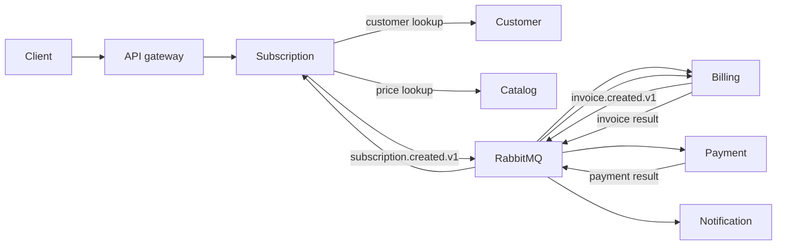

# Billing Platform

*[English version](README.md)*

Платформа биллинга и подписок из семи сервисов на PHP 8.3+/Laravel. В
репозитории находятся локальный стек Docker Compose, Kubernetes-манифесты,
OpenAPI-контракт и межсервисные тесты.

## Сервисы

| Сервис | Ответственность |
| --- | --- |
| Identity | Учётные записи, мерчанты, участники, API-ключи и токены доступа |
| Customer | Клиенты и платёжные контакты |
| Catalog | Продукты и периодические тарифы |
| Subscription | Жизненный цикл подписки и планирование продлений |
| Billing | Инвойсы и биллинговые циклы |
| Payment | Попытки оплаты и результаты провайдера |
| Notification | Уведомления об успешной оплате |

Каждый сервис владеет своей логической базой PostgreSQL. Синхронные запросы
выполняются по HTTP, изменения состояния распространяются через RabbitMQ.
Локальные изменения и исходящие события фиксируются одной транзакцией через
outbox. Inbox защищает консьюмеры от повторной обработки события.



Подробные контракты описаны в
[архитектурной документации](docs/architecture/overview.ru.md),
[индексе ADR](docs/adr/README.ru.md) и
[каталоге событий](docs/architecture/event-catalog.ru.md). Реализованный
публичный HTTP API зафиксирован в
[OpenAPI 3.1](docs/openapi/openapi.yaml).

## Локальная разработка

Требования: Docker, Docker Compose, GNU Make, PHP 8.3 или новее и Composer.

Создайте `.env` с локальными ключами приложений, ключами подписи, сервисными
учётными данными и паролями инфраструктуры:

```bash
make init
```

Запустите платформу и проверьте шлюз:

```bash
make up
make health
```

Полезные команды:

| Команда | Назначение |
| --- | --- |
| `make ps` | Показать контейнеры |
| `make logs` | Читать логи контейнеров |
| `make down` | Остановить стек |
| `make clean` | Остановить стек и удалить локальные тома |
| `make rotate-secrets` | Заменить локальный набор секретов |
| `make kind-secrets` | Создать Kubernetes Secrets из игнорируемого `.env` |

Шлюз доступен по адресу `http://localhost:8080`. PostgreSQL использует порт
`5432`, RabbitMQ использует `5672`, интерфейс управления доступен на
`http://localhost:15672`. Учётные данные хранятся в `.env`.

Зарегистрируйтесь через `POST /v1/auth/register`, затем передавайте полученный
токен доступа в маршруты мерчанта `/v1/merchants/{merchant}/...`.

## Тесты

| Команда | Область проверки |
| --- | --- |
| `make test` | Unit, integration и feature suites всех сервисов |
| `make test-docs` | Ссылки и переводы Markdown, соответствие OpenAPI маршрутам |
| `make test-compose` | Component, service integration, E2E и resilience suites |
| `make test-kind` | Ingress, rollout и business smoke tests в существующем kind-кластере |
| `make test-load` | Ограниченный k6 smoke test в одноразовом Compose-стеке |
| `make test-all` | Все перечисленные проверки |

`make test-kind` по умолчанию использует контекст
`kind-pet-payment-billing-platform`; его можно заменить через
`KIND_CONTEXT=<context>`. Тест намеренно перезапускает `billing-api`. Тесты
Compose создают изолированные стеки и удаляют их тома после каждого набора.

Структура тестов и правила проверки границ описаны в
[docs/architecture/testing-strategy.ru.md](docs/architecture/testing-strategy.ru.md).

## Развёртывание и ограничения

Корневой Compose запускает все API, фоновые процессы, PostgreSQL, RabbitMQ и
Nginx. Kubernetes-ресурсы находятся в `infrastructure/kubernetes/`; локальный
overlay запускает те же семь сервисов с PostgreSQL и одним узлом RabbitMQ.
RabbitMQ Operators, KEDA, External Secrets и стек наблюдаемости подключаются
отдельно.

Сейчас используются тестовые адаптеры платежей и email. Приложения передают
correlation ID, но пока не экспортируют телеметрию OpenTelemetry. Для рабочего
окружения также нужны внешнее хранилище секретов, реальные адаптеры провайдеров
и настройки ресурсов и SLO.
